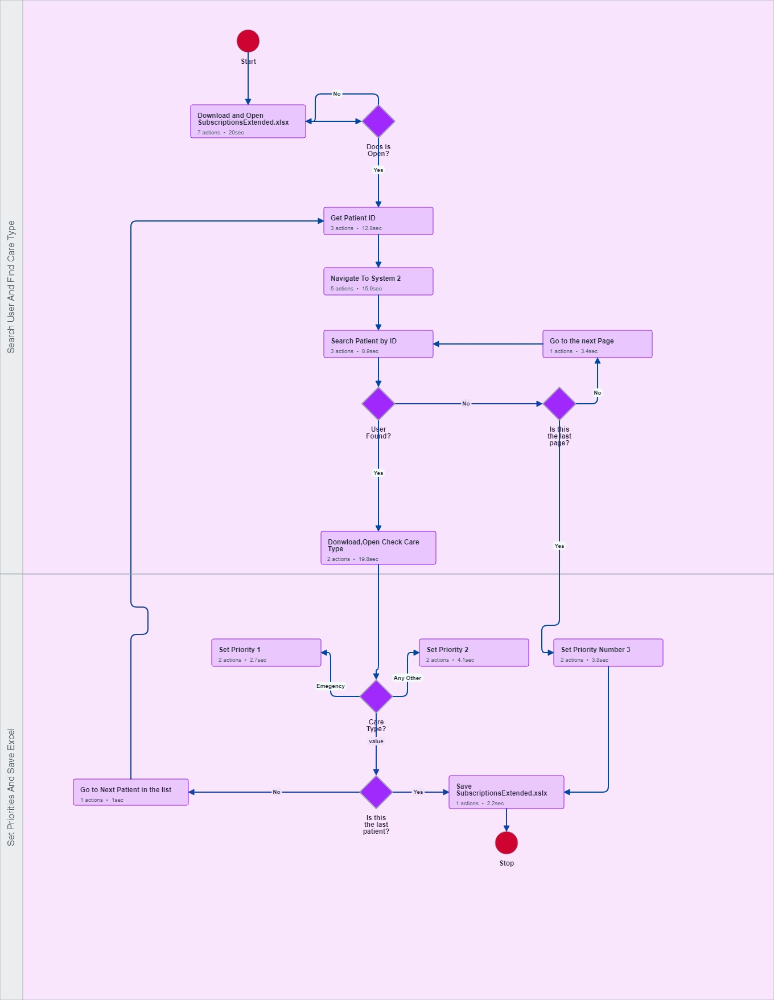

# Processing Patient Data - UiPath Task Capture Project


## Overview

Welcome to the UiPath Task Capture project repository! This project utilizes UiPath Task Capture for process documentation, with a focus on the "Build Diagram" approach. This methodology is ideal when the structure of the process is well-known, particularly for complex processes with branching scenarios.

## Project Description

### Objective

The main objective is to leverage the "Build Diagram" feature in UiPath Task Capture to create comprehensive process documentation. This method is most suitable for processes where the overall structure is clear, making it efficient for capturing detailed actions.

### Key Features

- **Structured Process Mapping:** Utilize the "Build Diagram" functionality to construct a workflow diagram that outlines the process structure.

- **Complex Process Support:** This approach is best suited for complex processes with branching scenarios, providing a clear visual representation.

- **Detailed Action Capture:** Once the workflow diagram is built, capture detailed actions, including step-by-step instructions, screenshots, and annotations.

## Getting Started

### Prerequisites

Before getting started, ensure you have the following installed:

- [UiPath Task Capture](https://docs.uipath.com/task-capture/docs/installation)

### Installation

1. Clone this repository to your local machine:

   ```bash
   git clone https://github.com/majortank/ProcessingPatientData.git
   ```

2. Open UiPath Task Capture and import the project file located in the repository.

3. Start capturing and documenting your processes using the "Build Diagram" approach!
